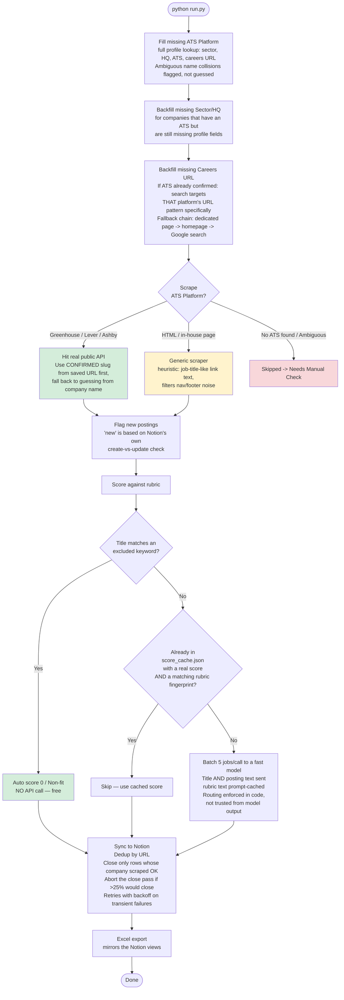

# New Opportunities Demo

An automated pipeline that tracks job postings across a curated list of
target companies, scores each posting against a custom fit rubric using
Claude, and syncs everything into a live Notion dashboard.

Built by directing Claude (Anthropic's AI model) to architect, write, and
iteratively debug the implementation — the architecture decisions, cost
optimizations, and business logic (the rubric) are mine; Claude wrote and
fixed the code under direction.

*Note: this is a public demo version of a private repo that runs against
my own live target company list. The scoring rubric is my actual
criteria; the keyword filters and code architecture are the same as the
private version. Only the real company/application data has been
removed — that stays in a private database, not committed here.*

## What it does

1. **Researches companies automatically.** Given just a company name, it
   looks up which Applicant Tracking System (ATS) the company uses,
   their sector, HQ, and careers page URL — flagging ambiguous name
   collisions rather than guessing.
2. **Scrapes job postings** — using real public APIs for companies on
   Greenhouse, Lever, or Ashby, and a best-effort generic scraper for
   companies with in-house career pages.
3. **Scores every posting** against a rubric (`scoring/rubric.md`) using
   Claude — the posting's own text, not just its title — batched and
   cached to keep API costs low. The cache is fingerprinted against the
   rubric, so editing the rubric re-scores everything instead of serving
   stale answers.
4. **Syncs results to Notion**, deduplicated by URL, with dedicated views
   for new postings, scored matches, ambiguous cases needing review, and
   non-fits. A posting is only marked closed when its company actually
   scraped — a timeout never retires a live job.
5. **Rehearses before it spends.** `--dry-run` performs every read and
   scrape but skips all writes and all paid calls, printing what it would
   have done.

## How it works



## Architecture highlights

- **Cost-optimized scoring**: batches jobs per API call with the rubric
  prompt-cached, and routes high-volume scoring to a cheaper, faster
  model (Haiku) while reserving a stronger model (Sonnet, with web
  search) for the harder company-research judgment calls — far cheaper
  than a naive one-call-per-job approach.
- **A cache that knows when it's wrong**: cached scores are stamped with
  a fingerprint over the rubric text, the model id, the excluded-keyword
  list, and a version constant. Change any input to a score and the
  affected entries are re-scored automatically. Without this, editing the
  rubric silently changed nothing.
- **Absence is not proof of deletion**: a posting missing from a run is
  equally consistent with a scraper timeout, so rows are only closed for
  companies that scraped successfully — and a run that would close more
  than 25% of open rows aborts the close pass entirely rather than
  retiring a live board on one bad afternoon.
- **Persistent negative caching**: every "checked, nothing found" result
  writes a permanent marker, so a company is never re-researched (and
  re-paid for) once genuinely checked. A search that *fails* due to an
  error is treated differently from one that *succeeds and finds
  nothing* — errors retry next run instead of writing a false negative.
- **Resilient sync**: all HTTP goes through one shared session
  (`http_client.py`) that retries with growing backoff on 429s and 5xxs
  only, respecting `Retry-After`. One failed write no longer takes down a
  run. Speculative ATS slug guesses deliberately use a separate
  fail-fast session, where retrying a wrong guess just wastes time.
- **Free pre-filtering**: job titles matching an excluded-keyword list
  get an instant "Non-fit" with zero API cost, before ever reaching the
  scoring step.

## Setup

```bash
git clone https://github.com/<your-username>/new-opportunities-demo.git
cd new-opportunities-demo
pip install -r requirements.txt
cp .env.example .env
# fill in .env with your own Notion integration token, database IDs,
# and Anthropic API key — see comments in .env.example
```

Then export the variables (or use `python-dotenv`, already handled
automatically by `run.py`) and run:

```bash
python run.py --dry-run   # rehearsal: no writes, no API spend
python run.py             # the real thing
python -m pytest tests/   # offline checks, no network or keys needed
python output_excel.py    # rebuild the workbook from existing output/
```

`--dry-run` skips every Notion write and every Anthropic call and prints
what it would have done. It still performs read-only Notion queries and
still scrapes public ATS endpoints, so it is a rehearsal, not an offline
mode.

### `output/` ships empty on purpose

A fresh clone has an empty `output/` holding only a `.gitkeep`, and that is
the intended state — nothing is missing. Everything the pipeline writes lands
there and none of it is committed: `jobs.json` and `skipped_companies.json`
from the scrape, `score_cache.json` (the scores already paid for),
`seen_jobs.json` (run history), and the generated `.xlsx` workbook. The
directory fills itself on your first run.

That also means `python output_excel.py` has nothing to rebuild from until
you have run the pipeline at least once.

## Notion setup

You'll need two Notion databases:

**Target List** — Company (title), Sector / Focus (text), HQ (text),
Source (text), ATS Platform (text), Scrape Method (text), Careers URL
(URL type), Jobs (relation → Job Postings)

**Job Postings** — Job Title (title), Company (relation → Target List),
Score (number), Routing (select: Scored / Needs Review / Non-fit),
Reasoning (text), Ambiguity Note (text), IC Role (checkbox), Location
(text), URL (url), ATS (text), First Seen / Last Seen (date), Still Open
(checkbox), New This Run (checkbox), Date Applied (date), Application
Notes (text)

`Careers URL` and `URL` must be Notion **URL**-type properties, not rich
text — Notion rejects an empty string on a URL property, so empty is
written as null.

Create a Notion internal integration at notion.so/my-integrations, share
it with both databases via each database's "Connections" menu, and put
the token and database IDs in `.env`.

## Customizing the rubric

Edit `scoring/rubric.md` directly — it's sent as-is as the scoring
system prompt, so any plain-English scoring criteria works. No code
changes needed.

## Extending to more ATS platforms

Each API-backed scraper lives in `scrapers/<platform>.py` and exposes a
`fetch_jobs(company_name)` function. To add a new platform, add a file
here, register it in the `SCRAPERS` dict in `run.py`, and optionally add
its URL pattern to `KNOWN_PATTERNS` in `ats_finder/find_ats.py` so it's
detected automatically.

## Tests

```bash
python -m pytest tests/
```

The suite is offline — no network, no API keys, no Notion. It covers the
close-pass rules that decide whether a posting is retired: company-relation
resolution, the scraped-successfully guard, the 25% ratio valve, its 20-row
floor, and the empty-database case.

## License

MIT
