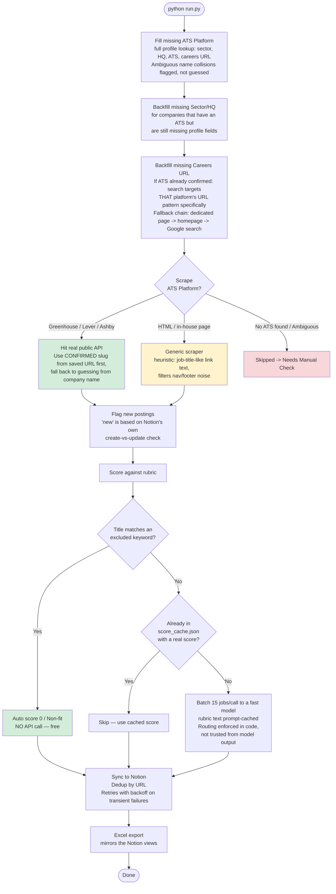

# New Opportunities Demo

An automated pipeline that tracks job postings across a curated list of
target companies, scores each posting against a custom fit rubric using
Claude, and syncs everything into a live Notion dashboard.

Built by directing Claude (Anthropic's AI model) to architect, write, and
iteratively debug the implementation — the architecture decisions, cost
optimizations, and business logic (the rubric) are mine; Claude wrote and
fixed the code under direction.

*Note: this is a public demo version of a private repo that runs against
my own live target company list. The scoring rubric is my actual
criteria; the keyword filters and code architecture are the same as the
private version. Only the real company/application data has been
removed — that stays in a private database, not committed here.*

## What it does

1. **Researches companies automatically.** Given just a company name, it
   looks up which Applicant Tracking System (ATS) the company uses,
   their sector, HQ, and careers page URL — flagging ambiguous name
   collisions rather than guessing.
2. **Scrapes job postings** — using real public APIs for companies on
   Greenhouse, Lever, or Ashby, and a best-effort generic scraper for
   companies with in-house career pages.
3. **Scores every posting** against a rubric (`scoring/rubric.md`) using
   Claude, batched and cached to keep API costs low.
4. **Syncs results to Notion**, deduplicated by URL, with dedicated views
   for new postings, scored matches, ambiguous cases needing review, and
   non-fits.

## How it works



## Architecture highlights

- **Cost-optimized scoring**: batches 15 jobs per API call with the
  rubric prompt-cached, and routes high-volume scoring to a cheaper,
  faster model while reserving a stronger model for the harder
  company-research judgment calls — roughly 90% cheaper than a naive
  one-call-per-job approach.
- **Persistent negative caching**: every "checked, nothing found" result
  writes a permanent marker, so a company is never re-researched (and
  re-paid for) once genuinely checked. A search that *fails* due to an
  error is treated differently from one that *succeeds and finds
  nothing* — errors retry next run instead of writing a false negative.
- **Resilient sync**: individual Notion writes retry with backoff before
  failing, and one failed write no longer takes down an entire run —
  it's logged and retried automatically next time.
- **Free pre-filtering**: job titles matching an excluded-keyword list
  get an instant "Non-fit" with zero API cost, before ever reaching the
  scoring step.

## Setup

```bash
git clone https://github.com/<your-username>/new-opportunities-demo.git
cd new-opportunities-demo
pip install -r requirements.txt
cp .env.example .env
# fill in .env with your own Notion integration token, database IDs,
# and Anthropic API key — see comments in .env.example
```

Then export the variables (or use `python-dotenv`, already handled
automatically by `run.py`) and run:

```bash
python run.py
```

## Notion setup

You'll need two Notion databases:

**Target List** — Company (title), Sector / Focus (text), HQ (text),
Source (text), ATS Platform (text), Scrape Method (text), Careers URL
(URL type)

**Job Postings** — Job Title (title), Company (relation → Target List),
Score (number), Routing (select), Reasoning (text), Location (text), URL
(url), First Seen / Last Seen (date), Still Open (checkbox), New This Run
(checkbox)

Create a Notion internal integration at notion.so/my-integrations, share
it with both databases via each database's "Connections" menu, and put
the token and database IDs in `.env`.

## Customizing the rubric

Edit `scoring/rubric.md` directly — it's sent as-is as the scoring
system prompt, so any plain-English scoring criteria works. No code
changes needed.

## Extending to more ATS platforms

Each API-backed scraper lives in `scrapers/<platform>.py` and exposes a
`fetch_jobs(company_name)` function. To add a new platform, add a file
here, register it in the `SCRAPERS` dict in `run.py`, and optionally add
its URL pattern to `KNOWN_PATTERNS` in `ats_finder/find_ats.py` so it's
detected automatically.

## License

MIT
